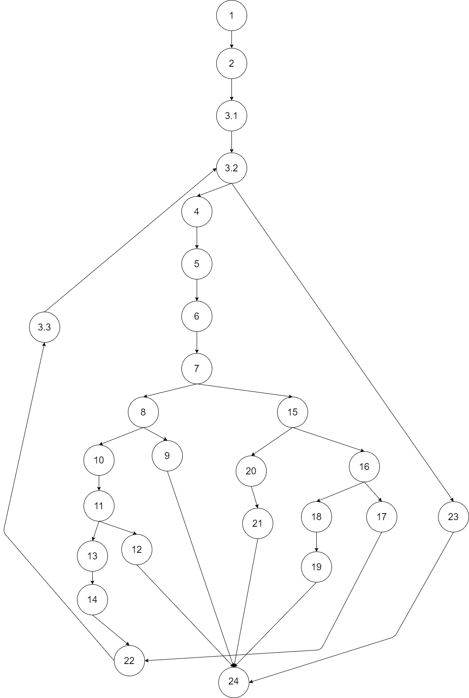

# Втора лабораториска вежба по Софтверско инженерство  
## Нена Анастасова, индекс бр. 171531  
## Група на код:  
Јас ја добив групата на код 6  
  
## Control Flow Graph
  
  
## Цикломатска комплексност  
Цикломатската комплексност на овој код е 7. Ја добив со користење на формулата V(G) = E - N + 2 каде што E е бројот на рабови, а N е бројот на јазли. Истиот број го добивам и со користење на формулата P+1, каде P е бројот на предикатни јазли.
